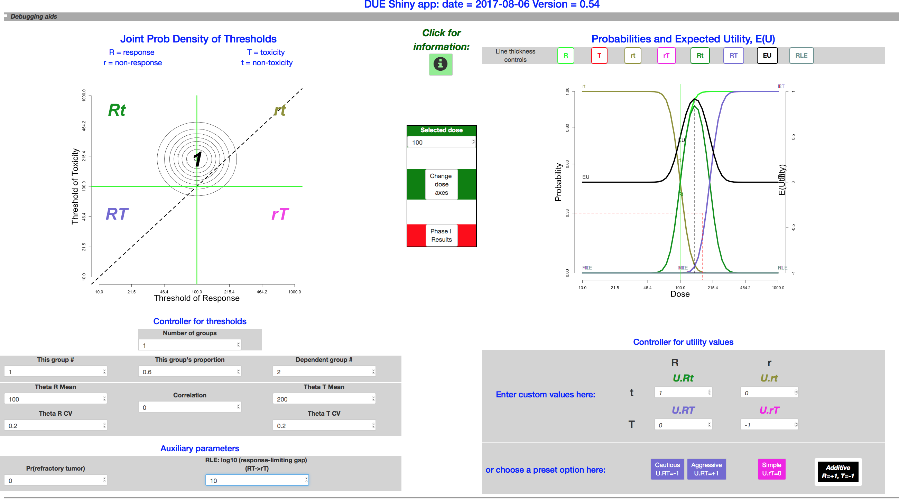

  
```{r setup, include=FALSE}
knitr::opts_chunk$set(echo = TRUE)
```
<!-- Check out http://rmarkdown.rstudio.com/authoring_pandoc_markdown.html and http://pandoc.org/MANUAL.html -->

### Introduction


DUE, the Dose Utility Explorer package for R, is an interactive environment
 for exploring relationships between priors, utilities, and choice of dose,
 when toxicity and response are determined by patient-specific thresholds.
 A user can manipulate inputs describing a hypothetical dose choice scenario.
 A number of important aspects have been omitted, in order to focus on the
 factors that are patient-specific.
 
 The main output is expected utility as a function of dose.
 
##### *Primary uses*
This package, with its app, is part of a broader effort to make clinical trials more responsive to patients, more rational, and more humane. 


##### *Contributions and history*
This package stemmed from a chapter of the doctoral dissertation of Meihua Wang. It was developed for eventual publication by Roger Day. It rested on tck/tk for the graphics, requiring installation of R and the X window system, as well as tck/tk. Therefore its reach was severely limited.

In 2017, Marie Gerges, working with Day, spearheaded the conversion to RStudio shiny, which provides universal access through a published web page. In addition several new features were added. The tcl/tk version is no longer supported.

### Inputs
Factors included are:


* The current “prior” or population joint distribution of thresholds for toxicity
 and for response; the distribution may be multimodal.
* Response-limiting toxicity, representing the case where a patient with a
 low threshold for toxicity has enough toxicity to require coming off the
 treatment.
* Refractoriness.
* The combined personal utility of the toxicity and response outcome status.


Not included are:

* The possibility that probabilities of events might be non-monotonic in dose.
* Priors for the parameters describing the joint distribution.
* Data that might have contributed to the 
"prior" for the pair of thresholds.
* The scientific, commercial, or prestige-related value of the information
 to be gained.
* Costs of the drug or of dealing with adverse events, not incurred by the
 patient.
 
### Overview of the interface

The package presents a window that includes:
* upper left: a graph of the threshold distribution 
* upper right: a graph of the mappings from dose to the expected utility,
 together with probabilities of events and event combinations,
* lower left: controllers for the threshold distribution
* lower right: controllers for the utility values 


#### *The threshold distribution inputs*

##### *Threshold distribution parameters*

We assume that each patient has a pair of thresholds, 
 $\theta_{R}$
 for response and 
 $\theta_{T}$  for toxicity.
 If the dose exceeds the threshold, then the corresponding event occurs.
 The model for the joint distribution of toxicity and response thresholds
 is a mixture of joint lognormals. The idea is that patients differ 
 
 The joint lognormal for each sub-population is described by 
 
* the two medians of the corresponding normal distributions,
$\mu_{R} = \exp(E(\log \theta_{R}))$ and  $\mu_{T} = \exp(E(\log \theta_{T}))$, 
* its two coefficients of variation 
$CV_{R}$ and $CV_{T}$,  and 
* $\rho$, the correlation between $\log\mu_{R}$ and 
$\log\mu_{T}$.


 A vector the length of the number of subpopulations describes the probabilities
 of each component of the mixture distribution.
 Each of these parameters is controlled by a pair of scale (or slider) objects
 and input boxes, so that either one can be used to change the parameter
 value.
 

To select which subpopulation the parameters refer to, there is a input box labeled 
$This\ population$.
 The number of subpopulation is set in the input box 
$\#Pops$ ; if increased or decreased, reasonable adjustments take place elsewhere.

 Another input box holds the population fraction for 
$This\ population$.
 Because the probabilities of the components must add to one, we provide a box labeled 
$Which\ population\ fraction\ follows$
, to select one component that will adjust to accommodate a change in another component's probability.


### Response-limiting toxicity

Response-limiting toxicity represents the case where a patient with a low
 threshold for toxicity has enough toxicity to prevent response, even if
 the response threshold is low enough.
 For example, a toxicity experience might require coming off the treatment
 or reducing the dose below the threshold.
 Or, a treatment-caused fatality might occur before a response which otherwise
 would have happened can occur.
 This idea is represented by a parameter called 
$Kdeath$ in the code. Its input box is labeled as $RLE:\ log_{10} (response-limiting\ gap)\ (RT\to rT)$. A response-limiting toxicity is a toxicity so severe that, although the patient would otherwise have responded, death or suspension of the treatment makes that impossible.
 It represents the log10 of the ratio between the patient's toxicity threshold
 and the dose at which toxicity is so severe that response cannot happen.
 The assumption is that this ratio is the same for all patients.
 (This works similarly to the relaionship between thresholds for different grades of toxicity introduced in Richard Simon's paper on accelerated titration designs; thus the letter $K$ is borrowed notation.)


#### *Refractoriness*

Some proportion of patients may have disease which will not respond to the treatment at any dose.
 This parameter appears to be necessary to better reflect experience in
 cancer treatment.


#### *Display of the joint threshold distribution*

On the upper left side of the window is the contour plot for the joint threshold
 distribution.
 If one clicks on the graph close to one of the modes, then the parameter
$This population$
 should change to refer to the corresponding subpopulation.
 If the click is too far away, then a 
$favorite dose$
 is selected, corresponding to the closest diagonal point 
 $(D,D)$.
$D$
 is selected, it divides the graph into four quadrants, corresponding to
 four outcomes: 


* rt: neither response nor toxicity
* rT: only toxicity
* Rt: only response
* RT: both response and toxicity


If the 
$Response-limiting toxicity$ parameter 
$K$
is small enough, then there also appears an incursion of the 
$rT$ region towards the left at the bottom, invading the 
$RT$ region. This is discussed above:  [Response-limiting toxicity] .

#### *Log-normal conversions*

The choice of log-normal distributions entails conversion between log and native dose scales. The graph is a log-log graph, so the labeling is on the unlogged dose scale
 while the spacing is on the logged scale. The contour lines correspond to the density in log-normal space.

## *Probabilities and utilities*

### *Calculation of probabilities*

For each dose in a vector of doses of interest, the probabilities of each of the four regions are computed by integration.
 Varying the dose gives the mapping from dose to each outcome probability.

### *Utility parameters and expected utility*

For decision analysis, a necessary input is the utility function which values outcomes.

The scale/text pairs on the lower right specify the utility values for these four outcomes.
 There are also buttons to set the utilities to specific values:
 $Additive, Simple, Cautious,  Aggressive$.

 All four of these utilities set $U_{rt}=0$, since that is what you get without any treatment (dose = 0).

 The Simple utility assignment values only the 
$Rt$  outcome, and sets the other three to zero.
 It is commonly used in studies of Phase I and II clinical trial designs. It expresses the idea that only $Rt$ is a worthy outcome. But it equates $rt$ with $rT$, as if toxicity is no concern unless $R$ is achieved.

 The other three utility assignments all penalize the outcome $rT$ with a utility of -1. They differ in the valuation of the $RT$ outcome:
 
 Option |  $U(RT)$
 -------|--------
Cautious |     -1
Additive|     \ 0
Aggressive| +1

In addition to these defaults, the input boxes allow any assignments to the four utilities.
 
### Expected utility

The expected utility $EU$
 for each dose is calculated as the weighted average of the four utilities, weighted by the four event probabilities.
 
 $E(Rt)  Pr(Rt) + E(rt)  Pr(rt) + E(rT)  Pr(rT) + E(RT)  Pr(RT)$


### Display of the expected utility and probabilities

On the upper right side of the window is a graph showing these probabilities
 (left-side scale) and expected utilities (right-side scale).
 The vertical green line corresponds to the 
$favorite dose$ selected in the contour plot.
 The black dotted vertical line picks out the dose maximizing expected utility.

The eight boxes at the top of the graph are three-way toggles, which
 cycle each of the curves through the settings 
`thick line`, `thin line`, and `invisible`.

### *Other features of the interface*

#### *In the middle column:*

* There is an Information button, which launches this document.

* A user can click a button to change the dose range and number of ticks on the dose scales. 

* A numeric input box allows setting the $Favorite\ dose$, or selected dose. This only has the effect of moving the green lines in both plots.

* The $Phase\ I$ button brings up a window with the probabilities of stopping at each dose level.

#### *At the top* 

Clicking the checkbox at the left of the grey band opens facilities for saving and loading files with parameter values for the joint threshold distribution and the utility values.

#### *At the bottom* 

Clicking the checkbox at the left of the grey band opens an instance of `shinyDebuggingPanel`, allowing access to R and Javascript expressions.

## *Examples*

#### *A single population*


In this ideal situation, there is a fairly sharp peak in the expected utility EU, with an optimal dose somewhere between $\mu_{R} = 100$ and $\mu_{T} = 200$. Only the `Aggressive` utility function has substantially different optimal, driving the optimal dose near the top of the dose range. The correlation has essentially no effect. Whether correlation = 0, so that all the variation is pharmacodynamics, or correlation near 1, so that it is nearly all pharmacokinetics, the utility curve is basically unchanged.

Lowering the median value $\mu_{T} = 100$ to equal $\mu_{R}$, then toxicity is highly likely, response less so. In that case, the utility choice has profound effects. Only the `Simple` utility shows a local EU peak at 100. With the `Additive` utility, the EU curve is flat. A 3+3 phase I trial on 7 tiers logarithmically spaced from 50 to 200, would stop at tier 100, with maximum tolerated dose (MTD) = 79.4 with probability 72%. 


## Effect of multimodality

TO DO.


