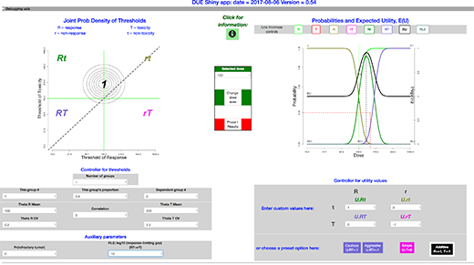
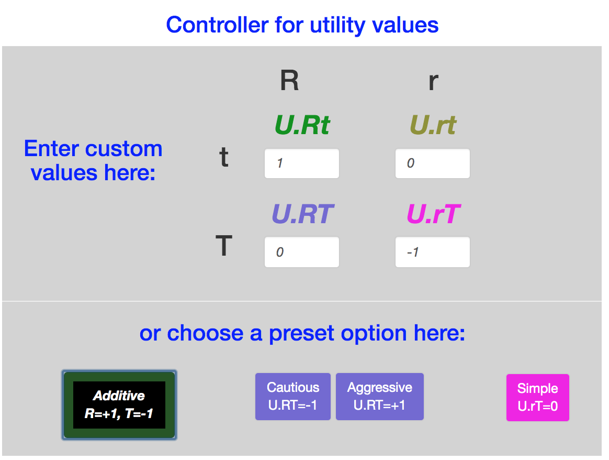
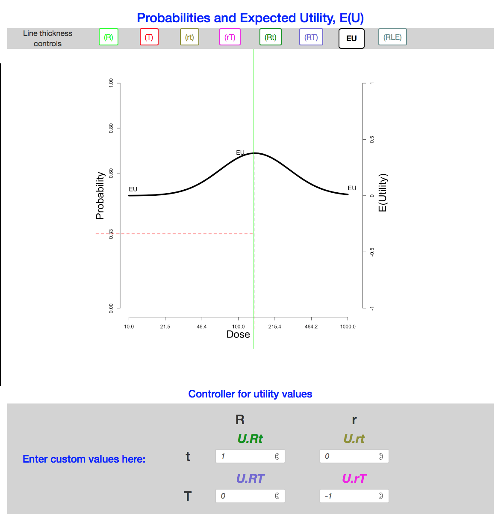
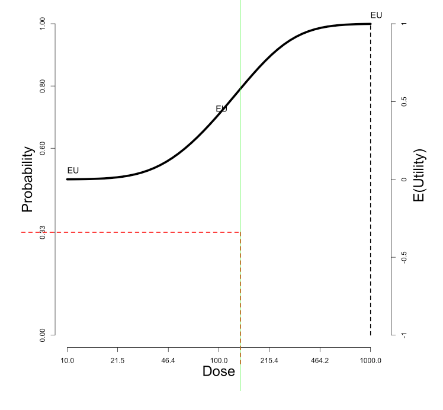
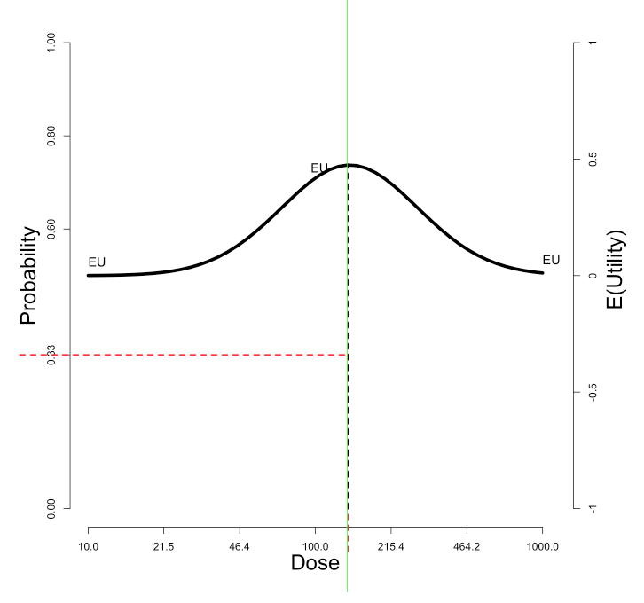
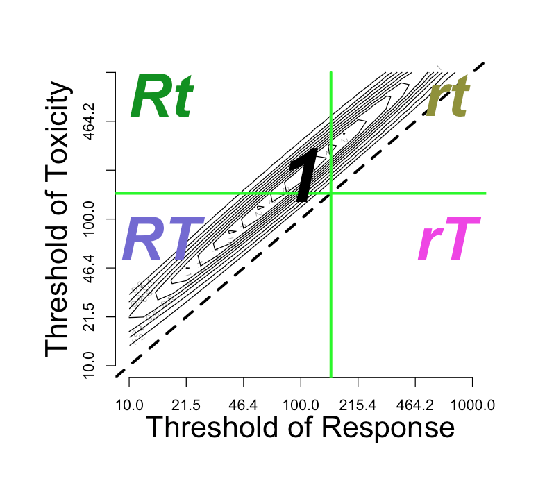
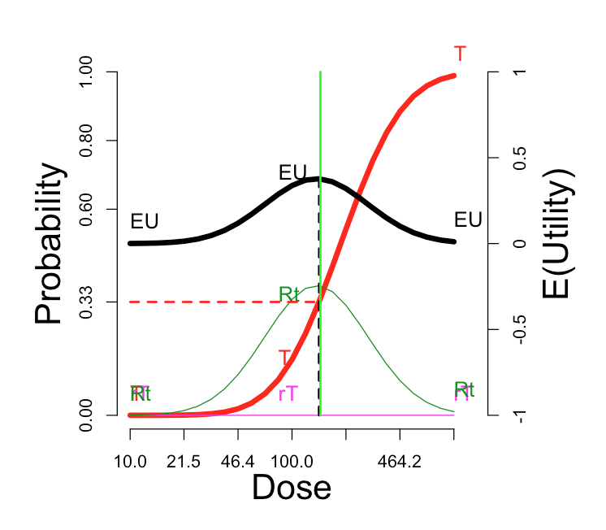

  
```{r setup, include=FALSE,  echo=FALSE}
require(knitr)
require(DUE)
knitr::opts_chunk$set(
  echo = FALSE
  )
```

<!-- Check out http://rmarkdown.rstudio.com/authoring_pandoc_markdown.html 
http://pandoc.org/MANUAL.html https://yihui.name/knitr/options/
-->


```{r plottingFunctionsInclude}
#source("../inst/doc/DUE_vignette_plottingFunctions.R")
#  Moved to R folder.
```

### Introduction


DUE, the Dose Utility Explorer package for R, is an interactive environment
 for exploring relationships between priors, utilities, and choice of dose,
 when toxicity and response are determined by patient-specific thresholds.
 A user can manipulate inputs describing a hypothetical dose choice scenario.
 A number of important aspects have been omitted, in order to focus on the
 factors that are patient-specific.
 
 The primary output is the expected utility, as a function of dose.

##### *Primary uses*
This package, with its app, is part of a broader effort to make clinical trials more responsive to patients, more rational, and more humane. One use is to explore the consequences of unconscious assumptions we tend to make as we plan clinical trials. 

* Is the success of a clinical trial plot dependent on assumptions whose truth we do not know?
* Can a research plan be made more robust against assumptions?
* When does our subjective valuation of toxicity versus response matter?
* When is the expected utility strongly dependent on dose? When is it multimodal as a function of dose?
* When is the effect of pharmacokinetics variation important?
* How much improvement could we achieve if we could stratify on patient subgroup, or limit recruitment to, one of multiple subgroups of patients?

In addition, there are potential uses for individual patients. One aspect of personalized medicine is personalized dose.

##### *Contributions and history*

This package stemmed from a chapter of the doctoral dissertation of Meihua Wang. It was developed for eventual publication by Roger Day. Originally, it rested on tck/tk for the graphics, requiring installation of R and the X window system, as well as tck/tk. Therefore its reach was severely limited.

In 2017, Marie Gerges, working with Day, spearheaded the conversion to RStudio shiny, which provides universal access through a published web page. In addition several new features were added. The tcl/tk version is no longer supported.

### Inputs

The factors accounted for are:

* The current “prior” or population joint distribution of dose thresholds for toxicity ($T$)
 and for response ($R$). 
 
 (The four possible outcomes are: $RT$, $Rt$, $rT$, and $rt$, where $T$ means toxicity occurs, $t$ means it doesn't, $R$ means toxicity occurs, $r$ means it doesn't. ) 
* The distribution may be multimodal.
* Response-limiting toxicity ($RLT$), representing the case where a patient with a
 low threshold for toxicity has enough toxicity to require coming off the
 treatment before response could be achieved.
* Refractoriness, representing a portion of tumors entirely unable to respond regardless of the dose.
* The combined personal utility of the toxicity (T) and response (R) outcome events.


Not included are:

* The possibility that probabilities of events might be non-monotonic in dose.
* Priors for the parameters describing the joint distribution (hyperparameters).
* Updating of the threshold distribution for the pair of thresholds with data.
* The scientific, commercial, or prestige-related value of the information
 to be gained.
* Costs of the drug or of dealing with adverse events, not incurred by the
 patient.
* Multiple degrees of the response and toxicity outcomes, for example complete versus partial response, or mild versus severe adverse events.

The inputs are difficult to assign values to. In principle one could estimate the "prior", the joint threshold distribution. But this would require treating many patients at many doses. Each patient's outcome would tell us only which quadrant the patient's joint threshold is in. Therefore this program is best thought of as a platform for thought experiments.


### Overview of the interface

The package presents a window that includes:

* upper left: a graph of the threshold distribution 
* upper right: a graph of the mappings from dose to the expected utility,
 together with probabilities of events and event combinations,
* lower left: controllers for the threshold distribution
* lower right: controllers for the utility values 

Here is a view of the full interface. 


Other views for various examples appear in the section [*Examples*].


#### *The threshold distribution inputs*

##### The joint threshold model
We assume that each patient has a pair of thresholds, 
 $\theta_{R}$
 for response and 
 $\theta_{T}$  for toxicity.
 If the dose exceeds the threshold, then the corresponding event, $R$ or $T$, occurs.

 The model for the joint distribution of toxicity and response thresholds
 is a mixture of joint lognormals.  
The groups in the mixture might differ by differences in pharmacokinetics, affecting both thresholds, so that one expects them to be centered along a line. Pharmacokinetics processes mediate the conversion of the dose into the delivered concentation.  


```{r fig.height=4, fig.width=8, echo=F}
 par(mfrow=c(1, 2) )
thisExample = 'Pharmacokinetic-example-two-groups'
envHolder = plotThresholdInVignette(thisExample) 
plotEUprobsInVignette(thisExample, envHolder) 
```
The groups can also differ in the pharmacodynamics: the effect of the concentration at the affected tissues.
  Pharmacodynamics processes mediate the effects of exposure on the tissues.
A discrete factor affecting pharmacodynamics of response affects only $\theta_{R}$, so that groups are placed horizontally on the plot. 
```{r fig.height=4, fig.width=8, echo=F}
 par(mfrow=c(1, 2) )
thisExample = 'Pharmacodynamics-response-two-groups'
envHolder = plotThresholdInVignette(thisExample) 
plotEUprobsInVignette(thisExample, envHolder) 
```
A discrete factor affecting pharmacodynamics of toxicity affects only $\theta_{T}$, and the groups are placed vertically.
```{r fig.height=4, fig.width=8, echo=F}
 par(mfrow=c(1, 2) )
thisExample = 'Pharmacodynamics-toxicity-two-groups'
envHolder = plotThresholdInVignette(thisExample) 
plotEUprobsInVignette(thisExample, envHolder) 
```

The number of groups is set in the input box labeled $Number\ of\ groups$ (with value $input\$nPops$ ); if increased or decreased, reasonable adjustments take place elsewhere.

 A vector the length of the number of groups describes the probabilities
 of each component of the mixture distribution.

To select which group the parameters refer to, there is an input box labeled 
$This\ group\ \#$.
 Another input box labeled $This\ group's\ fraction$ holds the fraction belonging to this group within the total population.
 Because the probabilities of the components must add to one, wen the groups' fraction changes another group's fraction must change in the opposite direction. When there are more than 2 groups, there is more than one choice for which group changes. We provide a box labeled $Dependent\ group\ \#$, to select one component that will adjust to accommodate a change in another component's probability.

 
The joint lognormal density for each group in the mixture is described by these parameters: 
 
* the two medians of the corresponding normal distributions,
$\mu_{R} = \exp(E(\log \theta_{R}))$ and  $\mu_{T} = \exp(E(\log \theta_{T}))$, 
* its two coefficients of variation 
$CV_{R}$ and $CV_{T}$,  and 
* $\rho$, the correlation between $\log\mu_{R}$ and 
$\log\mu_{T}$.

(The corresponding input values are: $input\$thetaRmedian$, $input\$thetaTmedian$, $input\$thetaR.CV$, $input\$thetaT.CV$, $input\$correlation$.)


### Response-limiting toxicity

Response-limiting toxicity represents the case where a patient with a low
 threshold for toxicity has enough toxicity to prevent response, even if
 the response threshold is low enough.
 For example, a toxicity experience might require coming off the treatment
 or reducing the dose below the threshold.
 Or, a treatment-caused fatality might occur before a response which otherwise
 would have happened can occur.
 This idea is represented by a parameter called 
$Kdeath$ in the code. Its input box is labeled as $RLT:\ log_{10}$ (response-limiting toxicity event) for converting $(RT\to rT)$. A response-limiting toxicity is a toxicity so severe that, although the patient would otherwise have responded, death or suspension of the treatment makes that impossible.
This parameter is the gap between log10 of the patient's toxicity threshold
 and log10 of the dose at which toxicity is so severe that response cannot happen. It appears on the left-hand plot as a vertical distance below the $Rt/RT$ border to the border where the $rT$ region encroaches into $RT$.
 
 
 The assumption is that this gap is the same for all patients.
 (This works similarly to the relationship between thresholds for different grades of toxicity introduced in Richard Simon's paper on accelerated titration designs; thus the letter $K$ is borrowed notation.)


#### *Refractoriness*

Some proportion of patients may have disease which will not respond to the treatment at any dose.
 This parameter appears to be necessary to better reflect experience in
 cancer treatment.


#### *Interaction with the joint threshold distribution*

On the upper left side of the window is the contour plot for the joint threshold
 distribution.
 If one clicks on the graph close to one of the modes, then the parameter
$This\ group\ \#$
 should change to refer to the corresponding group
 If the click closer to the diagonal than any mode, then dose corresponding to the closest diagonal point (the geometric mean) becomes the new $Selected\ dose$.

The $Selected\ dose$, whether selected by clicking or by entering into the $Selected\ dose$ input, will divide the graph into four quadrants, corresponding to four outcomes: 

* *rt*: neither response nor toxicity
* *rT*: only toxicity
* *Rt*: only response
* *RT*: both response and toxicity


If the 
$Response-limiting\ toxicity$ parameter 
$input\$Kdeath$
is small enough, then there also appears an incursion of the 
$rT$ region towards the left at the bottom, invading the 
$RT$ region. This is discussed above:  [Response-limiting toxicity] .
If $input\$Kdeath$ equals 1, then the vertical distance between the horizontal $Selected\ dose$ line and the incursion line is one order of magnitude. 


#### *Log-normal conversions*

The choice of log-normal distributions entails conversion between log and native dose scales. The graph is a log-log graph, so the labeling is on the unlogged dose scale
 while the spacing is on the logged scale. The contour lines correspond to the density in log-bivariate-normal space.

## *Probabilities and utilities*

### *Calculation of probabilities*

For each dose in a vector of doses of interest, the probabilities of each of the four regions are computed by integration.
 Varying the dose gives the mapping from dose to each outcome probability.

### *Utility parameters and expected utility*

For decision analysis, a necessary input is the utility function which values outcomes.

The scale/text pairs on the lower right specify the utility values for these four outcomes.
 There are also buttons to set the utilities to specific values:
 $Additive, Simple, Cautious,  Aggressive$.

 All four of these utilities set $U_{rt}=0$, since $rt$ is the outcome without any treatment (dose = 0). all four also set $Rt$ equal to 1, so that the optimal result, a dose at which $Pr(Rt) = 1$, has the same utility regardless of any other parameter.

 The $Simple$ utility assignment considers  only the 
$Rt$  outcome to be valuable, with utility value = 1, and sets the other three utility values to zero.
 It is commonly used in studies of Phase I and II clinical trial designs. It expresses the idea that only $Rt$ is a worthy outcome. But it equates $rt$ with $rT$, as if toxicity is no concern as long as $R$ is achieved.

 The other three utility assignments all penalize the outcome $rT$ with a utility of -1. They differ in the valuation of the $RT$ outcome:
 
 Option |  $U(RT)$
 -------|--------
$Cautious$ |     -1
$Additive$|     \ 0
$Aggressive$| +1

In addition to these defaults, the input boxes allow any assignments to the four utilities.
 
### Expected utility

The expected utility $EU$
 for each dose is calculated as the weighted average of the four utilities, weighted by the four event probabilities:
 
 $EU = E(Rt)  Pr(Rt) + E(rt)  Pr(rt) + E(rT)  Pr(rT) + E(RT)  Pr(RT)$


### Display of the expected utility and probabilities

On the upper right side of the window is a graph showing these probabilities
 (left-side scale) and expected utilities (right-side scale).
 The vertical green line corresponds to the 
$Selected\ dose$ indicated by the green cross in the contour plot.
 The black dotted vertical line picks out the dose maximizing expected utility, which we can label $OptDose$ for short. 
 
The horizontal red line shows the dose corresponding to $Pr(T) = 1/3$. This dose we will call the TRUE "$MTD$" (MTD = "maximum tolerated dose"), since in some views this would ideally be the best dose to report forward for further study, if one could somehow identify it without doing an experiment at all. The idea is that a dose should be sufficiently toxic reflecting potential for enough activity to counterbalance the risk, but not so toxic as to be unusable. Below we explore how suitable this rule of thumb is, under what circumstances. The traditional Phase I trial generally produces a MTD intended to estimate the true MTD. 
 
Sometimes the true $MTD$ is very close to $OptDose$, justifying the $Pr(T) = 1/3$ target; and sometimes not. This is discussed further later.

The eight boxes at the top of the graph are three-way toggles, which
 cycle each of the curves through the settings 
`thick line`, `thin line`, and `invisible`. 

To the right of the plot is a table of quantities of interest for the current plot. They include:

* highest.EU,
* OptDose.EU,
* EUatMTDdose,
* MTDdose,
* lowest.EU,
* highest.Rt,
* best.dose.Rt.

### *Other features of the interface*

#### *In the middle column:*

* There is an $Information$ button, which launches this document.

* A user can click a button to change the dose range and number of ticks on the dose scales. 

* A numeric input box allows setting the $Selected\ dose$, or selected dose. This only has the effect of moving the green lines in both plots.

* The $Phase\ I$ button brings up a pop-up window with the probabilities of stopping at each dose level. The dose levels are initially set at the doses at which the ticks occur in the graphs. The user can change these doses within the pop-up window. 

#### *At the top* 

Clicking the checkbox at the left of the grey band opens a $file\ panel$, a facility for saving and loading files with parameter values for the joint threshold distribution and the utility values. (For convenience, the middle column also has a toggle for this $file \ panel$.)

#### *At the bottom* 

Clicking the checkbox at the left of the grey band opens an instance of `shinyDebuggingPanel`, allowing access to R and Javascript expressions.

## *Examples*

#### *A single population*


In this ideal situation, there is a fairly sharp peak in the expected utility EU, with an optimal dose somewhere between $\mu_{R} = 100$ and $\mu_{T} = 200$. Only the `Aggressive` utility function has substantially different optimal, driving the optimal dose near the top of the dose range.

When the correlation equals 0, all the variation is due to independent response pharmacodynamics and toxicity pharmacodynamics. When it equals 1, the variation is thresholds is all pharmacokinetics, so shared between the two thresholds. As the correlation increases from 0 to 1, the utility curve flattens slightly, while the optimal EU dose is unchanged.

Lowering the median value $\mu_{T} = 100$ to equal $\mu_{R}$, then toxicity is highly likely, response less so. In that case, the utility choice has profound effects. Only the `Simple` utility shows a local EU peak at 100. With the `Additive` utility, the EU curve is flat. A 3+3 phase I trial on 7 tiers logarithmically spaced from 50 to 200, would stop at tier 100, with maximum tolerated dose (MTD) = 79.4 with probability 72%. 

## Is  Pr(toxicity) =  33% a good proxy for optimal expected utility?

In this figure, the "T" curve is made visible, for comparison with the EU curve. The optimal dose is nearly the same as the dose at which the probability of toxicity is 33%.

Additive utility settings | Probabilities and E(U) 
-- | --
{ width=95% } | { width=95% }  


The venerable "3+3" Phase I design is sometimes described as aiming to estimate the dose tier closest to Pr(toxicity) =  33%. To rationalize this in vague terms, lowering the dose might decrease the response probability too much, while raising it would of course increase the risk, and possibly entail "response limiting events" that would mask or make irrelevant an increase in response rate.

### Effect of the utility function

The utility function in the figure is "Additive": $U_{RT}$=0. At the other three default utility functions, here are the comparable curves:

 "Cautious": $U_{RT}$ = -1 | "Aggressive": $U_{RT}$ = +1  |"Simple":   $U_{RT}$ = $U_{Rt}$ = 0             
--------------------------|--------------------------|--------------------------
 { width=90% } | { width=90% }  | { width=90% }

 The cautious assignment lowers the optimal dose somewhat. The aggressive assignment sends it all the way to the maximum dose on the scale.  Changing the utility values to the simple scheme, which credits only the outcome `Rt` and does not penalize more for `rT`, does not change the optimum dose, but enhances its optimality (from $E(U)$=0.38 to $E(U)$=0.47).
 
 From here on we stick with the additive utility assignment. Certainly a user can explore different values of $U_{RT}$ and $U_{rT}$ if desired, setting those values with reference to the desired outcome $Rt$ assigned utility of 1. A response is no cure, but a toxicity is no fun. 

### Effect of the correlation

In the foregoing, we set the correlation between the thresholds $\theta_{R}$ and $\theta_{T}$ to zero. Let's investigate what happens as we move the correlation to the other extreme, nearly one (0.99). This could occur if the pharmacodynamics (PD) of toxicity and response are strongly correlated across the population. More likely, the two PD processes are independent, but the  population variation in pharmacokinetics generates the correlation.  

With the "Additive" utility, changing to correlation = 0.99 does not change the $E(U)$ curve at all; th maximum is still 0.38. But switching to "Simple" utility does not enhance the optimal E(U).

Thresholds | Probabilities and E(U)
--------------------------|--------------------------
{ width=90% } | { width=90% } 

These observation are not generally true. A broad investigation may clarify when the correlation governing PK and PD really matters.

## Effect of multimodality


